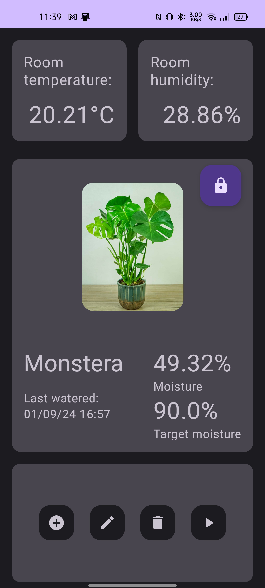
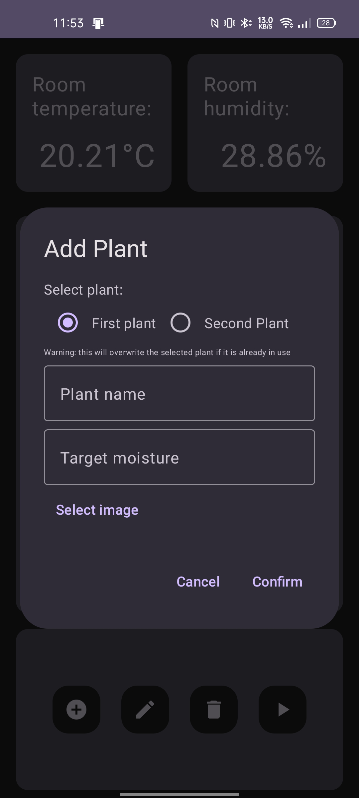

# Plant Watering Mobile App

## Overview

This project, a collaboration on Embedded Systems uni project, involved working with two colleagues. While they were responsible for developing the source code for the Raspberry Pi-based plant watering system, I took charge of creating the mobile app. The app, built using Jetpack Compose, connects to Firebase for data storage and synchronization, providing users with an intuitive interface to manage and automate plant watering.

## Features

- **Automated Watering**: Easily set up target moisture for different plants, and the system will automatically water them according to the defined moisture.

- **Firebase Integration**: Securely store and synchronize plant details and watering schedules across devices using Firebase.

- **Jetpack Compose UI**: Enjoy an intuitive and responsive user interface crafted with Jetpack Compose for efficient plant watering management.

## Requirements

- Android device with the app installed

## Screenshots

<table>
<tr>
<td>

*Main screen*

</td>
<td>

*Add plant dialog*

</td>
</tr>

